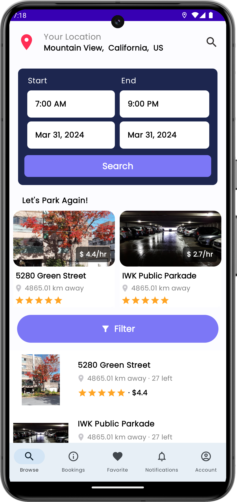
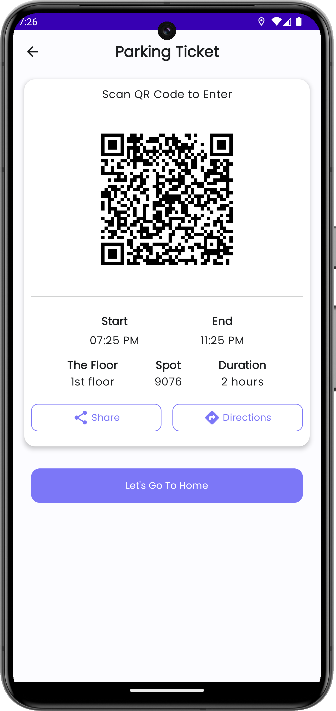

# ParkSpace

ParkSpace offers a sophisticated platform that harnesses GPS technology and real-time data to tackle the challenges of urban parking, providing seamless, affordable, and eco-friendly solutions. With features like nearby parking spot listings, advanced search and filtering options, booking history, and real-time navigation, ParkSpace caters to commuters, residents, businesses, and tourists alike, prioritizing convenience, accessibility, and sustainability in urban mobility. From stress-free parking options to optimized space utilization for businesses, ParkSpace endeavors to elevate the overall parking experience while fostering community engagement and knowledge sharing among users.

## Tech Stack

ParkSpace was built using the following technologies:

## Application Sneak Peek

    

        
        
Home Screen

    

    

        
        
Search Screen

    

    

        
        
Parking Details

    

    

        
        
Booking Form

    

    

        
        
Booking Summary Screen

    

    

        
        
Parking Ticket Screen

    

    

        
        
Navigation Feature

    

    

        
        
Active Bookings Screen

    

    

        
        
Active Booking Details Screen

    

    

        
        
Timer Screen

    

    

        
        
User Profile Screen

    

    

        
        
Notifications Screen

    

    

## ParkSpace - Build Instructions

### Cloning the Repository

Begin by cloning the ParkSpace repository using Git:

`git clone https://git.cs.dal.ca/patel33/csci_5708_group_12g_project.git`

### Open in Android Studio

Open the cloned ParkSpace project in Android Studio.

### Sync Gradle Files

Ensure that Gradle files are synced by clicking on the "Sync Project with Gradle Files" icon or through the "File" menu.

### Configure Firebase

ParkSpace utilizes Firebase services. Set up your Firebase project and add the necessary configuration files (google-services.json) to the app module.

### Configure API Keys

If your application uses APIs requiring keys (e.g., Google Maps API, Firebase services), obtain the necessary API keys and add them to your project's configuration files (e.g., google_maps_api.xml).

### Build Variants

ParkSpace supports different build variants for debugging and release. Select the desired build variant from the "Build Variants" tab in Android Studio.

### Run the Application

You can run the ParkSpace application on an emulator or a physical device connected to your development machine. Select the target device from the device dropdown menu in Android Studio and click on the "Run" button.

### Generating APK

To generate an APK file for distribution, select "Build" > "Build Bundle(s) / APK(s)" > "Build APK(s)" from the Android Studio menu. The APK file will be generated in the project's "build" directory.

## Dependencies

The following dependencies are used in the ParkSpace project:

- com.google.firebase:firebase-perf-ktx:20.5.2 - Firebase Performance Monitoring
- io.coil-kt:coil-compose:1.4.0 - Coil Compose
- androidx.core:core-ktx:1.12.0 - AndroidX Core Kotlin Extensions
- androidx.lifecycle:lifecycle-runtime-ktx:2.7.0 - AndroidX Lifecycle Runtime Kotlin Extensions
- androidx.activity:activity-compose:1.8.2 - AndroidX Activity Compose
- androidx.compose.ui:ui:$compose_version - Jetpack Compose UI Toolkit
- androidx.compose.ui:ui-graphics:$compose_version - Jetpack Compose UI Graphics
- androidx.compose.ui:ui-tooling-preview:$compose_version - Jetpack Compose UI Tooling Preview
- androidx.compose.material3:material3:1.2.1 - Jetpack Compose Material3 Components
- junit:junit:4.13.2 - JUnit Testing Framework
- androidx.test.ext:junit:1.1.5 - AndroidX JUnit Extension
- androidx.test.espresso:espresso-core:3.5.1 - Espresso Testing Framework
- com.google.firebase:firebase-auth - Firebase Authentication
- com.google.firebase:firebase-auth-ktx - Firebase Authentication Kotlin Extensions
- com.google.firebase:firebase-firestore-ktx - Firebase Firestore Kotlin Extensions
- androidx.navigation:navigation-compose:2.7.7 - AndroidX Navigation Compose
- androidx.constraintlayout:constraintlayout-compose:1.0.1 - ConstraintLayout Compose
- com.google.dagger:hilt-android:2.51 - Dagger Hilt for Android
- androidx.hilt:hilt-navigation-compose:1.2.0 - Hilt Navigation Compose
- androidx.appcompat:appcompat:1.6.1 - AndroidX AppCompat Library
- com.google.android.material:material:1.11.0 - Material Components for Android
- androidx.lifecycle:lifecycle-viewmodel-compose:2.7.0 - AndroidX Lifecycle ViewModel Compose
- org.jetbrains.kotlinx:kotlinx-coroutines-android:1.7.3 - Kotlin Coroutines for Android
- com.google.zxing:core:3.4.1 - ZXing Core (Barcode scanning library)
- com.journeyapps:zxing-android-embedded:4.2.0 - ZXing Android Embedded (Embedded barcode scanner)
- io.coil-kt:coil-compose:2.6.0 - Coil Compose (Image loading library for Jetpack Compose)
- androidx.compose.material3:material3:1.2.1 - Jetpack Compose Material3 Components
- androidx.core:core-splashscreen:1.0.1 - AndroidX Core Splashscreen
- androidx.datastore:datastore-preferences:1.0.0 - AndroidX DataStore Preferences
- com.maxkeppeler.sheets-compose-dialogs:core:1.0.2 - Sheets Compose Dialogs Core
- com.maxkeppeler.sheets-compose-dialogs:calendar:1.0.2 - Sheets Compose Dialogs Calendar
- com.maxkeppeler.sheets-compose-dialogs:clock:1.0.2 - Sheets Compose Dialogs Clock
- com.google.android.gms:play-services-location:21.2.0 - Google Play Services Location
- com.google.android.gms:play-services-maps:18.2.0 - Google Play Services Maps
- com.google.maps.android:maps-compose:2.14.0 - Google Maps Compose
- androidx.compose.ui:ui:$compose_version - Jetpack Compose UI Toolkit
- androidx.compose.material:material:$compose_version - Jetpack Compose Material
- androidx.compose.ui:ui-tooling:$compose_version - Jetpack Compose UI Tooling
- androidx.compose.foundation:foundation:$compose_version - Jetpack Compose Foundation
- androidx.compose.material:material-icons-core:$compose_version - Jetpack Compose Material Icons Core
- androidx.compose.material:material-icons-extended:$compose_version - Jetpack Compose Material Icons Extended
- com.google.android.material:material:$compose_version - Material Components for Android
- com.google.android.gms:play-services-maps:17.0.1 - Google Play Services Maps
- nl.dionsegijn:konfetti-compose:2.0.4 - Konfetti Compose (Confetti animations for Jetpack Compose)

## References

- "Jetpack," Android Developers. [Online]. Available: https://developer.android.com/courses/jetpack-compose/course?gad_source=1&gclid=Cj0KCQjwk6SwBhDPARIsAJ59GwdwBIOr9gs5K0ms4WsZCmfEz0aQpbGwGVCvEvOSszq05ySH2ua7EXQaAtb2EALw_wcB&gclsrc=aw.ds. [Accessed: March 11, 2024].
- "Dagger HILT," Android Developers. [Online]. Available: https://developer.android.com/training/dependency-injection/hilt-android. [Accessed: March 10, 2024].
- "Material UI," Material Design. [Online]. Available: https://m3.material.io/. [Accessed: March 16, 2024].
- "JUnit," JUnit. [Online]. Available: https://junit.org/junit5/. [Accessed: March 14, 2024].
- "Google Maps SDK," Google Developers. [Online]. Available: https://developers.google.com/maps/documentation/android-sdk/overview. [Accessed: March 13, 2024].
- "Firebase," Firebase. [Online]. Available: https://firebase.google.com/. [Accessed: March 9, 2024].

## Authors & Acknowledgements

- Dheemanth Kumawat (B00962830)
- Dhruv Kapoor (B00937833)
- Kainat Khan (B00937232)
- Parth Modi (B00962830)
- Rakshit Ranpariya (B00946421)
- Rushikumar Patel (B00948619)
- Sameer Amesara (B00961209)
- Smit Patel (B00963930)
- Sneh Patel (B00968316)
- Tathya Kapadia (B00968181)
